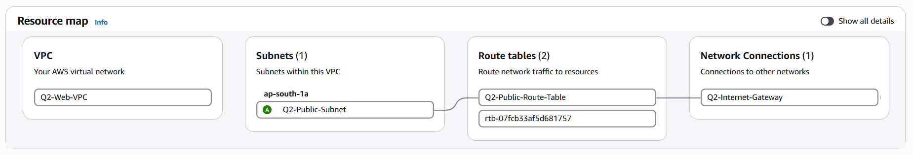
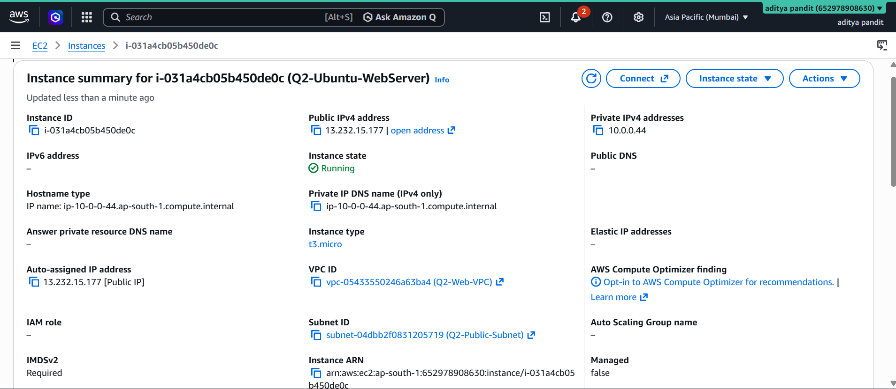
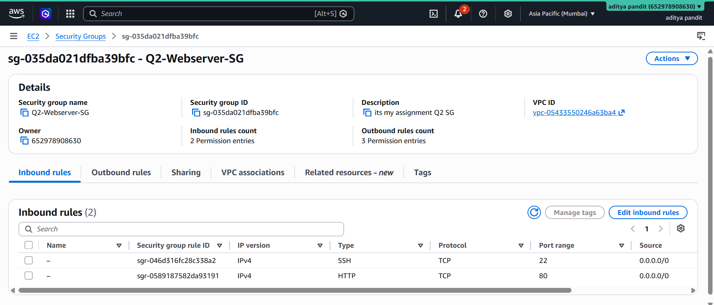
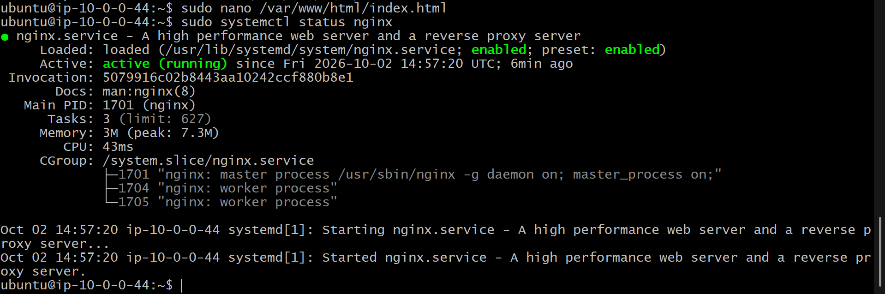
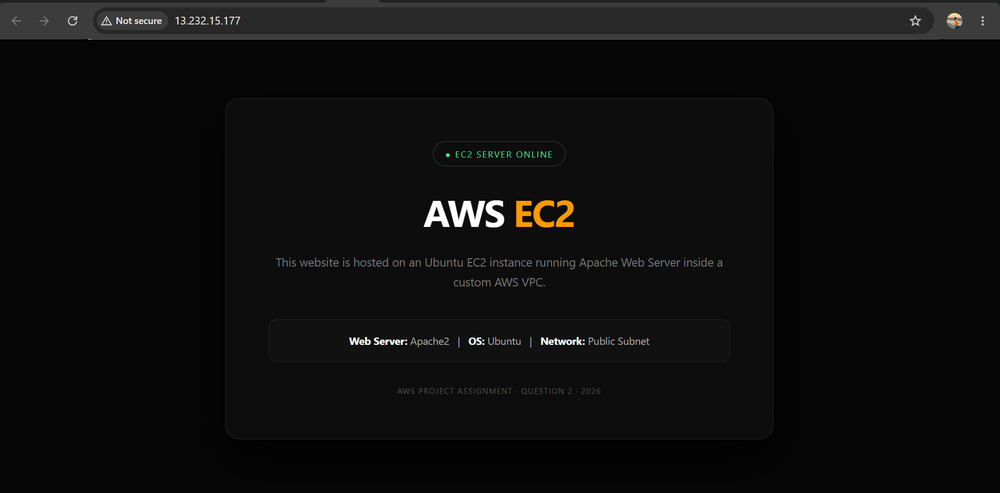

# AWS Q2 – Custom VPC and EC2 Web Server

## Project Overview

This project demonstrates the deployment of a web server using **Amazon EC2 inside a custom AWS VPC**.

A custom VPC was created with a public subnet, Internet Gateway, route table, and Security Group. An Ubuntu EC2 instance was deployed in the public subnet and configured with Nginx to host a custom HTML webpage accessible through the instance public IP.

## AWS Services Used

- Amazon VPC
- Amazon EC2
- Internet Gateway
- Subnet
- Route Table
- Security Group

## Technologies Used

- Ubuntu Linux
- Nginx
- HTML5
- SSH

## Architecture

```text
                    INTERNET
                        |
                        v
              Internet Gateway
                        |
                        v
             Q2-WebServer-VPC
                 10.0.0.0/16
                        |
                        v
             Q2-Public-Subnet
                 10.0.1.0/24
                        |
                        v
              Ubuntu EC2 Instance
                        |
                        v
                     Nginx
                        |
                        v
                  index.html
```

## Network Configuration

### VPC

```text
Name: Q2-WebServer-VPC
CIDR: 10.0.0.0/16
```

### Public Subnet

```text
Name: Q2-Public-Subnet
CIDR: 10.0.1.0/24
```

The subnet was configured as a public subnet by providing a route to the Internet Gateway.

### Internet Gateway

```text
Name: Q2-Internet-Gateway
```

The Internet Gateway was attached to the custom VPC.

### Route Table

```text
Name: Q2-Public-Route-Table
```

Route:

```text
Destination: 0.0.0.0/0
Target: Internet Gateway
```

The route table was associated with the public subnet.

The public subnet was also configured to automatically assign public IPv4 addresses.

## Security Group

```text
Name: Q2-WebServer-SG
```

Inbound rules:

| Protocol | Port | Source |
|---|---:|---|
| SSH | 22 | My IP |
| HTTP | 80 | 0.0.0.0/0 |

Outbound traffic uses the default configuration.

SSH access was restricted to the administrator's IP address, while HTTP was allowed from the internet so the web page could be accessed publicly.

## EC2 Configuration

```text
Name: Q2-Ubuntu-WebServer
Operating System: Ubuntu
Subnet: Q2-Public-Subnet
```

The EC2 instance was launched inside the public subnet and assigned a public IPv4 address.

## Nginx Installation

Nginx was installed on the Ubuntu EC2 instance using:

```bash
sudo apt update
sudo apt install nginx -y
```

The Nginx service was started and enabled:

```bash
sudo systemctl start nginx
sudo systemctl enable nginx
sudo systemctl status nginx
```

The default Nginx webpage was removed and replaced with a custom `index.html`.

## Website

The custom webpage displays the EC2 deployment information, including:

- EC2 Server Online
- AWS EC2
- Nginx
- Ubuntu
- Public Subnet

## Local Testing

The Nginx server was tested locally from the EC2 instance using:

```bash
curl http://localhost
```

The Nginx service status was also verified using:

```bash
sudo systemctl status nginx
```

## Browser Testing

The website was accessed through the EC2 instance public IPv4 address:

```text
http://<EC2-PUBLIC-IP>
```

The custom webpage was successfully displayed in the browser.

## Testing and Verification

The following tests were performed:

- Verified the custom VPC.
- Verified the public subnet.
- Verified Internet Gateway attachment.
- Verified the public route table.
- Verified the `0.0.0.0/0` route to the Internet Gateway.
- Verified Security Group rules.
- Verified EC2 instance deployment.
- Verified Nginx installation.
- Verified Nginx service status.
- Tested the web server using `curl`.
- Accessed the custom website through the EC2 public IP.

## Result

The Ubuntu EC2 web server was successfully deployed inside a custom AWS VPC.

Nginx was configured to serve a custom HTML webpage, and the website was successfully accessed through the EC2 public IP.

## Screenshots

### 1. VPC Resource Map



### 2. EC2 Instance



### 3. Security Group



### 4. Nginx Running



### 5. Working Website



## Project Structure

```text
AWS-Q2-EC2-Webserver/
│
├── README.md
├── index.html
└── screenshots/
```

## Security Considerations

- The EC2 instance is deployed inside a custom VPC.
- SSH access is restricted to the administrator's IP address.
- HTTP is exposed only because public web access is required by the project.
- The Security Group controls inbound network access to the server.

## Conclusion

This project demonstrates the basic AWS networking and compute configuration required to deploy a publicly accessible web server using a custom VPC, public subnet, Internet Gateway, Security Group, Ubuntu EC2, and Nginx.
